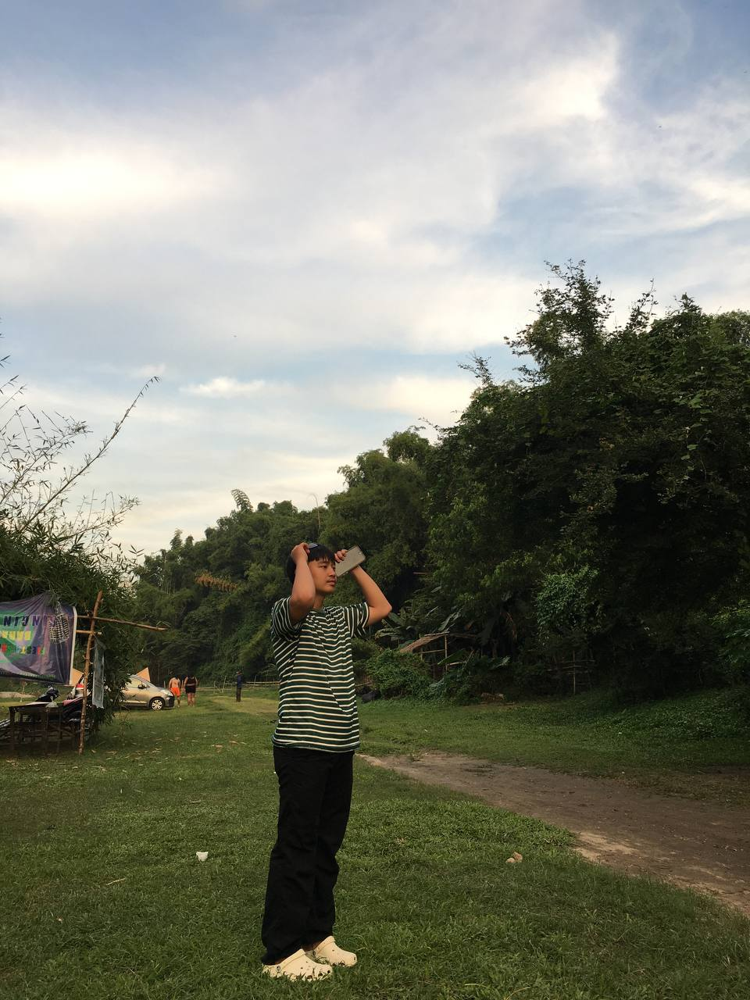

# EDM-portfolio-Athan-Panlilio
This portfolio will contain copies of my Enterprise Data Management Lab Activities/Exercises

## About Me

My name is Athan John T. Panlilio, and I am currently a first-year college student pursuing a Bachelor of Science in Information Systems (BSIS). I’m excited about the journey ahead in this field, where I hope to expand my knowledge and skills in technology. As I take my first steps in the world of programming, I’m learning the fundamentals of C and currently delving into Python, a language I find both interesting and versatile. I look forward to gaining a deeper understanding of coding and systems development as I progress in my studies.

When I’m not focusing on my academics, I enjoy spending my free time playing basketball. It’s a great way for me to stay active, challenge myself, and unwind. The energy of the game and teamwork are things I truly enjoy, and it’s always a good time when I get together with friends for a friendly match. Outside of basketball, I love hanging out with my friends, whether it’s simply bonding over casual conversations or doing fun activities together. They provide me with a great sense of support and motivation throughout my college life.

As I continue my college journey, I aim to balance my studies, hobbies, and social life, all while striving to develop both personally and academically. With a solid foundation in programming and an eagerness to learn more, I’m excited for the challenges and opportunities that lie ahead in my academic and personal growth.

## Education
- Currently taking 1st year college
- Senior High School: Panipuan High School - Senior High School
- High School: Panipuan High School
- Elementary: Adventus Learning Center

## My Projects
## Midterm lab task1 [Data Cleaning and Preparation using Excel](Midterm%20lab1)
## Midterm lab task2 [Data cleaning and transformation using power query](midterm%20lab%20task%202)
## Midterm lab taks3 [Creating pivot table and chart](Midterm%20lab%20task3)
